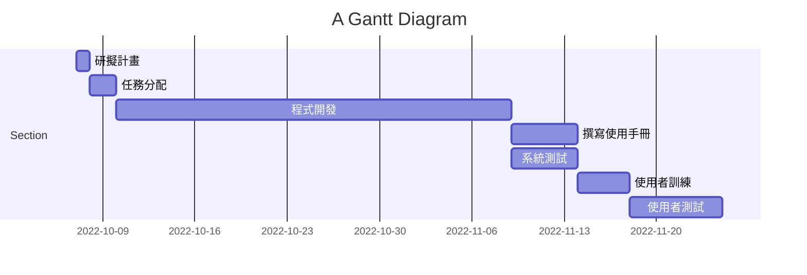

# 系統分析與設計

## 目錄

<!-- TOC -->

- [系統分析與設計](#%E7%B3%BB%E7%B5%B1%E5%88%86%E6%9E%90%E8%88%87%E8%A8%AD%E8%A8%88)
    - [目錄](#%E7%9B%AE%E9%8C%84)
    - [專案的組長與組員之姓名](#%E5%B0%88%E6%A1%88%E7%9A%84%E7%B5%84%E9%95%B7%E8%88%87%E7%B5%84%E5%93%A1%E4%B9%8B%E5%A7%93%E5%90%8D)
    - [專題題目與內容](#%E5%B0%88%E9%A1%8C%E9%A1%8C%E7%9B%AE%E8%88%87%E5%85%A7%E5%AE%B9)
    - [任務清單](#%E4%BB%BB%E5%8B%99%E6%B8%85%E5%96%AE)
    - [個別組員的任務](#%E5%80%8B%E5%88%A5%E7%B5%84%E5%93%A1%E7%9A%84%E4%BB%BB%E5%8B%99)
    - [PERT/CPM 圖](#pertcpm-%E5%9C%96)
    - [甘特圖](#%E7%94%98%E7%89%B9%E5%9C%96)

<!-- /TOC -->

## 專案的組長與組員之姓名

組長 : C108134127 黃紫旋  
組員 : C107118118 邱泓嘉  
組員 : C107118215 黃昱景  
組員 : C109118184 張倚瑄  

## 專題題目與內容

-  **專題題目**  
    -  **校內外送系統** 

-  **專題簡介** 

提供一個校內學餐外送平台，使忙碌的學生和教授們不需到學餐人擠人。校內送餐員(學生)也可以在閒暇時賺點外快，餐廳方也能提早準備好，不用面對人潮壓力。

-  **系統功能簡介** 
    - 顧客方 : 下單、取餐
    - 餐廳方 : 接單、出餐
    - 外送方 : 接單、送餐

-  **目的**  
    - 學生互助，提升效率
    - 降低群聚風險 

## 任務清單

| 任務  | 說明  | 需時 |前置任務 |
| :---:|:-----:| :---:|:-----: |
| 1    |研擬計畫    |  1  |  -   |
| 2    |任務分配    |  2  |   1  |
| 3    |程式開發    |  30 |   2  |
| 4    |撰寫使用手冊 |  5  |   3  |
| 5    |系統測試    |  5   |   3  |
| 6    |使用者訓練  |  4   |  4  |
| 7    |使用者測試  |  7   | 5,6 |

## 個別組員的任務

| 學號姓名  | 任務  | 
| :---:|:-----:| 
| C107118118 邱泓嘉    |研擬任務、任務分配    | 
| C107118215 黃昱景    |撰寫使用手冊    | 
| C108134127 黃紫旋  |程式開發、系統測試   |
| C109118184 張倚瑄  |使用者訓練、使用者測試|

## PERT/CPM 圖

## 甘特圖

# 校內外送平台

## 功能

### 登入 & 註冊

- 登入時 區分外送員(3)、使用者(2)、店家(1)

### 外送員
- 接單
- 取消接單
- 查看訂單
    - 查看訂單詳細內容
    - 領取完成
    - 完成訂單

### 使用者

- 查看店家
    - 詳細餐點
    - 選擇餐點
    - 下訂餐點
    - 取消餐點

### 店家

- 訂單列表(顯示:編號、時間)
    - 詳細訂單內容
    - 取消訂單
    - 交付外送員完成

## 功能性需求&非功能性需求

### 功能性需求

1. 使用者下單
2. 外送員接單
3. 店家接單

### [非功能性需求](https://zh.m.wikipedia.org/zh-tw/%E9%9D%9E%E5%8A%9F%E8%83%BD%E6%80%A7%E9%9C%80%E6%B1%82)

1. 反應時間：點餐者下單，傳送到店家接訂單。以及店家接受訂單，到外送員接取訂單時間盡量使流程簡化。
2. 效能：在大量訂單執行時，伺服器端處理資料不會受到延遲。
3. 使用性：對於使用者來說介面應淺顯易懂，降低學習時間。

## 流程

## 功能分解圖FDD

## 需求分析文字描述

## 使用案例圖與三個以上的使用案例說明
|使用案例名稱|外送員接單|
|:--------|:---|
|行動者|外送員|
|說明|描述外送員接單過程|
|完成動作|1.外送員查看訂單列表  2.外送員挑選訂單接單  3.系統顯示接單成功|
|替代方法|1.外送員查看訂單列表  2.外送員挑選訂單接單  3.顧客取消訂單或已被接單  4.外送員接單失敗|
|先決條件|接單介面至少有一項訂單|
|後置條件|接單結束，外送員可等待取餐|
|假設||

|使用案例名稱|顧客下單過程|
|:--------|:---|
|行動者|顧客|
|說明|描述顧客下單過程|
|完成動作|1. 顧客選擇餐點   2. 顧客確認餐點及價格   3. 顧客選擇結帳方式   4. 顧客送出訂單|
|替代方法|1. 顧客選擇餐點   2. 顧客確認餐點及價格   3. 顧客選擇結帳方式   4. 商家或外送員未接單，取消此訂單|
|先決條件|顧客必須選擇至少1樣商品|
|後置條件|顧客成功送出訂單後，等待外送員送達|
|假設||

|使用案例名稱|店家接單|
|:--------|:---|
|行動者|店家|
|說明|描述店家接單過程|
|完成動作|1.店家開啟接單功能  2.系統自動發派訂單給店家 |
|替代方法|1.店家關閉接單功能  2.系統無法發派訂單給店家 |
|先決條件|店家須開啟接單功能|
|後置條件|餐點製作完畢，等待外送員取餐|
|假設|若該餐點售罄，則取消此訂單|

## 用Figma劃出第一個使用案例的動態模擬畫面

## 繪出系統環境圖 (DFD)

## 繪製DFD 圖0 (須至少有三項以上的 程序)

