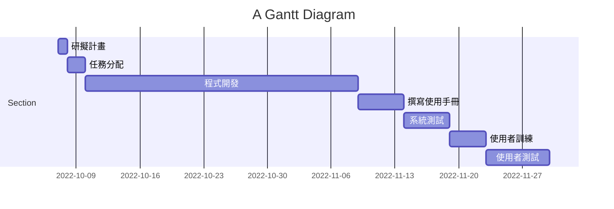

# 系統分析與設計

:::info
[課堂文件 2022 系統分析與設計](https://docs.google.com/document/u/0/d/1FYCc3NVY7s0kLOhmK065RSIAA6jiZxkNjgtti3HtSYQ/mobilebasic?fbclid=IwAR2A9CrvAm09l41xQj-_ucsijaHoDkh7LlOpCmmSOgFUiyztd0elxUlBofY)
:::

---
## 專案的組長與組員之姓名

組長 : C108134127 黃紫旋  
組員 : C107118118 邱泓嘉  
組員 : C107118215 黃昱景  
組員 : C109118184 張倚瑄  

## 專題題目與內容

-  **專題題目**  
    -  **校內外送系統** 

-  **專題簡介** 

提供一個校內學餐外送平台，使忙碌的學生和教授們不需到學餐人擠人。校內送餐員(學生)也可以在閒暇時賺點外快，餐廳方也能提早準備好，不用面對人潮壓力。

-  **系統功能簡介** 
    - 顧客方 : 下單、取餐
    - 餐廳方 : 接單、出餐
    - 外送方 : 接單、送餐

-  **目的**  
    - 學生互助，提升效率
    - 降低群聚風險 

## 任務清單

| 任務  | 說明  | 需時 |前置任務 |
| :---:|:-----:| :---:|:-----: |
| 1    |研擬計畫    |  1  |  -   |
| 2    |任務分配    |  2  |   1  |
| 3    |程式開發    |  30 |   2  |
| 4    |撰寫使用手冊 |  5  |   3  |
| 5    |系統測試    |  5   |   3  |
| 6    |使用者訓練  |  4   |  4  |
| 7    |使用者測試  |  7   | 5,6 |

## 個別組員的任務

| 學號姓名  | 任務  | 
| :---:|:-----:| 
| C107118118 邱泓嘉    |研擬任務、任務分配    | 
| C107118215 黃昱景    |撰寫使用手冊    | 
| C108134127 黃紫旋  |程式開發、系統測試   |
| C109118184 張倚瑄  |使用者訓練、使用者測試|

## PERT/CPM 圖

## 甘特圖

