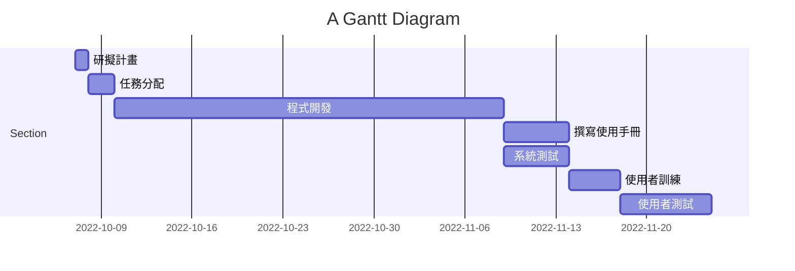

# 系統分析與設計

## 目錄

<!-- TOC -->

- [系統分析與設計](#%E7%B3%BB%E7%B5%B1%E5%88%86%E6%9E%90%E8%88%87%E8%A8%AD%E8%A8%88)
    - [目錄](#%E7%9B%AE%E9%8C%84)
    - [專案的組長與組員之姓名](#%E5%B0%88%E6%A1%88%E7%9A%84%E7%B5%84%E9%95%B7%E8%88%87%E7%B5%84%E5%93%A1%E4%B9%8B%E5%A7%93%E5%90%8D)
    - [專題題目與內容](#%E5%B0%88%E9%A1%8C%E9%A1%8C%E7%9B%AE%E8%88%87%E5%85%A7%E5%AE%B9)
    - [任務清單](#%E4%BB%BB%E5%8B%99%E6%B8%85%E5%96%AE)
    - [個別組員的任務](#%E5%80%8B%E5%88%A5%E7%B5%84%E5%93%A1%E7%9A%84%E4%BB%BB%E5%8B%99)
    - [PERT/CPM 圖](#pertcpm-%E5%9C%96)
    - [甘特圖](#%E7%94%98%E7%89%B9%E5%9C%96)

<!-- /TOC -->

## 專案的組長與組員之姓名

組長 : C108134127 黃紫旋  
組員 : C107118118 邱泓嘉  
組員 : C107118215 黃昱景  
組員 : C109118184 張倚瑄  

## 專題題目與內容

-  **專題題目**  
    -  **校內外送系統** 

-  **專題簡介** 

提供一個校內學餐外送平台，使忙碌的學生和教授們不需到學餐人擠人。校內送餐員(學生)也可以在閒暇時賺點外快，餐廳方也能提早準備好，不用面對人潮壓力。

-  **系統功能簡介** 
    - 顧客方 : 下單、取餐
    - 餐廳方 : 接單、出餐
    - 外送方 : 接單、送餐

-  **目的**  
    - 學生互助，提升效率
    - 降低群聚風險 

## 任務清單

| 任務  | 說明  | 需時 |前置任務 |
| :---:|:-----:| :---:|:-----: |
| 1    |研擬計畫    |  1  |  -   |
| 2    |任務分配    |  2  |   1  |
| 3    |程式開發    |  30 |   2  |
| 4    |撰寫使用手冊 |  5  |   3  |
| 5    |系統測試    |  5   |   3  |
| 6    |使用者訓練  |  4   |  4  |
| 7    |使用者測試  |  7   | 5,6 |

## 個別組員的任務

| 學號姓名  | 任務  | 
| :---:|:-----:| 
| C107118118 邱泓嘉    |研擬任務、任務分配    | 
| C107118215 黃昱景    |撰寫使用手冊    | 
| C108134127 黃紫旋  |程式開發、系統測試   |
| C109118184 張倚瑄  |使用者訓練、使用者測試|

## PERT/CPM 圖

## 甘特圖

